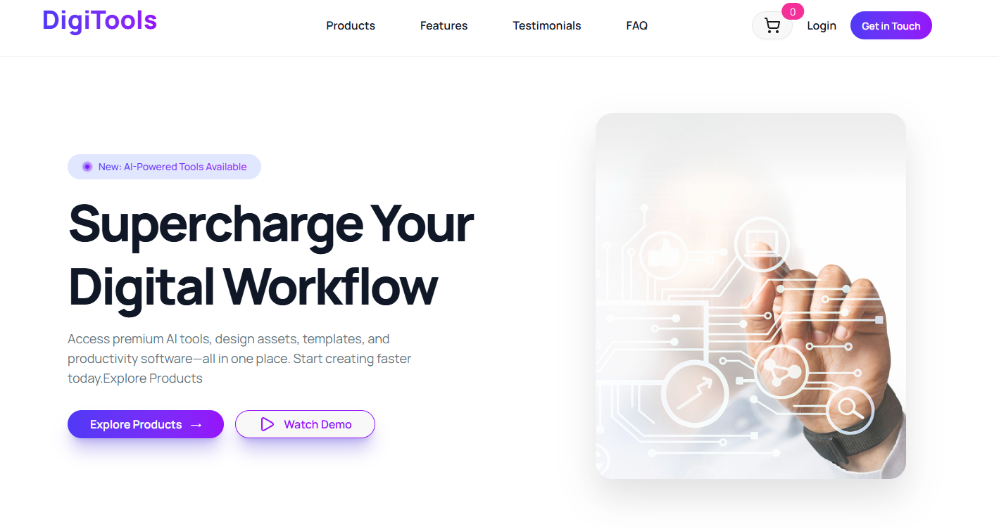

# 🚀 DigiTools

## 🧠 About the Project

**DigiTools** is a modern AI tools marketplace where users can explore and discover various AI-powered SaaS products in one place.
It provides a clean, user-friendly interface with dynamic data rendering to help users easily find tools for productivity, content creation, development, and more.

---

## ⚙️ Technologies Used

* ⚛️ React.js
* 🎨 Tailwind CSS + DaisyUI
* 🔥 JavaScript (ES6)
* 📦 JSON Data
* 🚀 Vercel (Deployment)

---

## ✨ Key Features

### 🔍 1. AI Tools Marketplace

Browse multiple AI tools with detailed information like price, features, and descriptions.

### 🏷️ 2. Smart Tag System

Each tool is categorized with tags like **Popular**, **New**, and **Best Seller** with dynamic UI styling.

### 🛒 3. Cart Functionality

Users can add tools to a cart and manage their selected tools easily.

---

## 📸 Preview



---

## 🌐 Live Link

👉 https://digitools-alpha.vercel.app/

---

## 📦 Installation

```bash
git clone https://github.com/your-username/digitools.git
cd digitools
npm install
npm run dev
```

---

## ⭐ Support

If you like this project, give it a ⭐ on GitHub!
